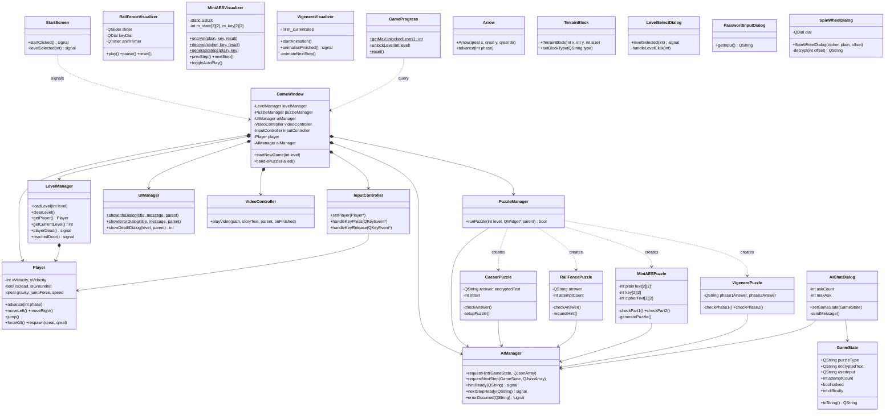

# Cryptography Game 类图

```mermaid
classDiagram
    direction TB
    class GameWindow {
        +startNewGame(int level)
        +handlePuzzleFailed()
        -LevelManager levelManager
        -PuzzleManager puzzleManager
        -UIManager uiManager
        -VideoController videoController
        -InputController inputController
        -Player player
        -AIManager aiManager
    }

    class StartScreen {
        +startClicked() signal
        +levelSelected(int) signal
    }

    class LevelManager {
        +loadLevel(int level)
        +clearLevel()
        +getPlayer() Player
        +getCurrentLevel() int
        +playerDead() signal
        +reachedDoor() signal
    }

    class Player {
        +advance(int phase)
        +moveLeft() +moveRight()
        +jump()
        +forceKill() +respawn(qreal, qreal)
        -int xVelocity, yVelocity
        -bool isDead, isGrounded
        -qreal gravity, jumpForce, speed
    }

    class PuzzleManager {
        +runPuzzle(int level, QWidget* parent) bool
    }

    class CaesarPuzzle {
        -QString answer, encryptedText
        -int offset
        -checkAnswer()
        -setupPuzzle()
    }

    class RailFencePuzzle {
        -QString answer
        -int attemptCount
        -checkAnswer()
        -requestHint()
    }

    class MiniAESPuzzle {
        -int plainText[2][2]
        -int key[2][2]
        -int cipherText[2][2]
        -checkPart1() +checkPart2()
        -generatePuzzle()
    }

    class VigenerePuzzle {
        -QString phase1Answer, phase2Answer
        -checkPhase1() +checkPhase2()
    }

    class RailFenceVisualizer {
        +play() +pause() +reset()
        -QSlider slider
        -QDial keyDial
        -QTimer animTimer
    }

    class MiniAESVisualizer {
        +encrypt(plain, key, result)$
        +decrypt(cipher, key, result)$
        +generateSteps(plain, key)$
        +prevStep() +nextStep()
        +toggleAutoPlay()
        -static SBOX$
        -int m_state[2][2], m_key[2][2]
    }

    class VigenereVisualizer {
        +startAnimation()
        +animationFinished() signal
        -animateNextStep()
        -int m_currentStep
    }

    class AIManager {
        +requestHint(GameState, QJsonArray)
        +requestNextStep(GameState, QJsonArray)
        +hintReady(QString) signal
        +nextStepReady(QString) signal
        +errorOccurred(QString) signal
    }

    class AIChatDialog {
        +setGameState(GameState)
        -sendMessage()
        -int askCount
        -int maxAsk
    }

    class UIManager {
        +showInfoDialog(title, message, parent)$
        +showErrorDialog(title, message, parent)$
        +showDeathDialog(level, parent) int
    }

    class VideoController {
        +playVideo(path, storyText, parent, onFinished)
    }

    class InputController {
        +setPlayer(Player*)
        +handleKeyPress(QKeyEvent*)
        +handleKeyRelease(QKeyEvent*)
    }

    class GameState {
        +QString puzzleType
        +QString encryptedText
        +QString userInput
        +int attemptCount
        +bool solved
        +int difficulty
        +toString() QString
    }

    class GameProgress {
        +getMaxUnlockedLevel() int$
        +unlockLevel(int level)$
        +reset()$
    }

    class Arrow {
        +Arrow(qreal x, qreal y, qreal dir)
        +advance(int phase)
    }

    class TerrainBlock {
        +TerrainBlock(int x, int y, int size)
        +setBlockType(QString type)
    }

    class LevelSelectDialog {
        +levelSelected(int) signal
        -handleLevelClick(int)
    }

    class PasswordInputDialog {
        +getInput() QString
    }

    class SpinWheelDialog {
        +SpinWheelDialog(cipher, plain, offset)
        -decrypt(int offset) QString
        -QDial dial
    }

    GameWindow *--> LevelManager
    GameWindow *--> PuzzleManager
    GameWindow *--> UIManager
    GameWindow *--> VideoController
    GameWindow *--> InputController
    GameWindow *--> Player
    GameWindow *--> AIManager

    LevelManager *--> Player
    PuzzleManager --> AIManager
    PuzzleManager ..> CaesarPuzzle : creates
    PuzzleManager ..> RailFencePuzzle : creates
    PuzzleManager ..> MiniAESPuzzle : creates
    PuzzleManager ..> VigenerePuzzle : creates

    CaesarPuzzle --> AIManager
    RailFencePuzzle --> AIManager
    MiniAESPuzzle --> AIManager
    VigenerePuzzle --> AIManager

    AIChatDialog --> AIManager
    AIChatDialog --> GameState

    InputController --> Player
    StartScreen ..> GameWindow : signals
    GameProgress ..> GameWindow : query
```
